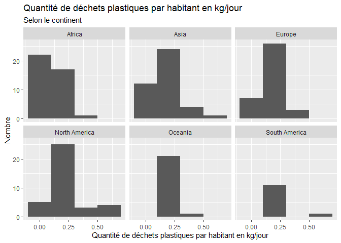
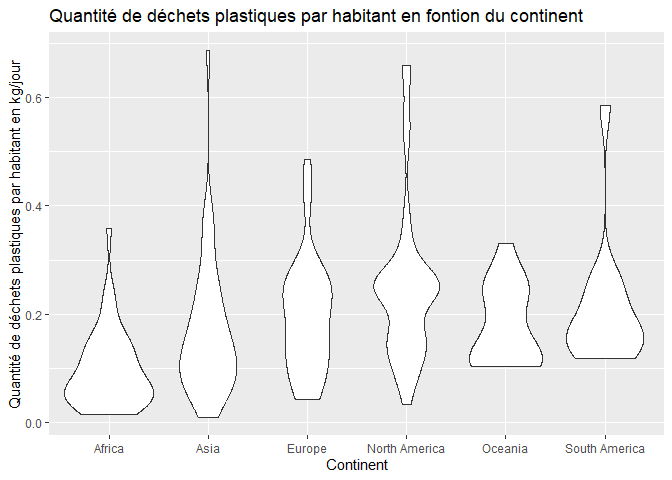

Lab 02 - Plastic waste
================
Britany Bureau
15 septembre 2025

## Chargement des packages et des données

``` r
library(tidyverse) 
```

``` r
plastic_waste <- read_csv("data/plastic-waste.csv")
```

Commençons par filtrer les données pour retirer le point représenté par
Trinité et Tobago (TTO) qui est un outlier.

``` r
plastic_waste <- plastic_waste %>%
  filter(plastic_waste_per_cap < 3.5)
```

## Exercices

### Exercise 1

``` r
ggplot(data = plastic_waste, aes(x = plastic_waste_per_cap)) +
  geom_histogram(binwidth = 0.2)+
  facet_wrap(.~continent)+
  labs(title = "Quantité de déchets plastiques par habitant en kg/jour selon le continent", x = "Quantité de déchets plastiques par habitant en kg/jour", y = "Nombre")
```

<!-- -->

La quantité de déchets platiques par habitant est moins élevées en
Océanie et en Amérique du sud.

### Exercise 2

``` r
ggplot(data = plastic_waste, aes(x = plastic_waste_per_cap, color = continent, fill = continent)) +
  geom_density(alpha = 0.5)+
  labs(title= "Densité de déchets plastiques par habitant en kg/jour selon le continent", x = "Quantité de déchets plastiques par habitant en kg/jour", y = "Densité")
```

<!-- -->

Le réglage de la couleur (color et fill) est dans la partie aes, car il
consite seulement à colorié les continents. Cependant pour le réglage de
la transparence (alpha), dans le paramètre aes, le logiciel essaie de
mettre la transparence proportionnelle à la variable. Cependant, comme
un continent n’est pas plus un continent qu’un autre, cela est
impossible. C’est pourquoi on met ce réglage dans geom_density() afin
que toutes les courbes soient de même transparence (choisie).

### Exercise 3

Boxplot:

``` r
ggplot(data = plastic_waste, aes(x = continent, y = plastic_waste_per_cap))+
  geom_boxplot()+
  labs(title = "Quantité de déchets plastiques par habitant en fontion du continent", x = "Continent", y = "Quantité de déchets plastiques par habitant en kg/jour" )
```

<!-- -->

Violin plot:

``` r
ggplot(data = plastic_waste, aes(x = continent, y = plastic_waste_per_cap))+
  geom_violin()+
  labs(title = "Quantité de déchets plastiques par habitant en fontion du continent", x = "Continent", y = "Quantité de déchets plastiques par habitant en kg/jour" )
```

<!-- -->

Les violin plots permettent de voir la distribution des données
contrairement aux boxplots.

### Exercise 4

``` r
ggplot(data = plastic_waste, aes(x = plastic_waste_per_cap, y = mismanaged_plastic_waste_per_cap, color = continent)) +
  geom_point()+
  labs(title = "Relation entre les déchets plastiques et ceux non gérés ", x = "Quantité de déchets plastiques par habitant en kg/jour ", y = "Quantité de déchets plastiques non gérés")
```

<!-- -->

Sur le graphe, on observe dans l’ensemble une relation
proportionnellement positive. Quand on ajoute la couleur par continent,
on peut voir que l’Afrique, l’Asie et l’Océanie tendent à avoir plus de
déchets non-gérés que les autres contients. On voit aussi que l’Amérique
du sud a moins de données que les autres et qu’elles sont plus basses.

### Exercise 5

``` r
ggplot(data = plastic_waste, aes(x = plastic_waste_per_cap, y = total_pop))+
  geom_point()+
  labs(title = "Relation entre la population totale et la quantité de déchets plastiques", x = "Quantité de déchets plastiques par habitant en kg/jour", y = "Population totale")
```

    ## Warning: Removed 10 rows containing missing values or values outside the scale range
    ## (`geom_point()`).

<!-- -->

``` r
ggplot(data = plastic_waste, aes(x = plastic_waste_per_cap, y = coastal_pop))+
  geom_point()+
  labs(title = "Relation entre la population costale et la quantité de déchets plastiques", x = "Quantité de déchets plastiques par habitant en kg/jour", y = "Population costale")
```

<!-- -->

Dans ces graphes, il est difficile d’observer les relations puisque les
échelles de la population sont très grandes. Cependant, on peut observer
une relation un peu plus forte pour la population costale.

## Conclusion

Recréez la visualisation:
